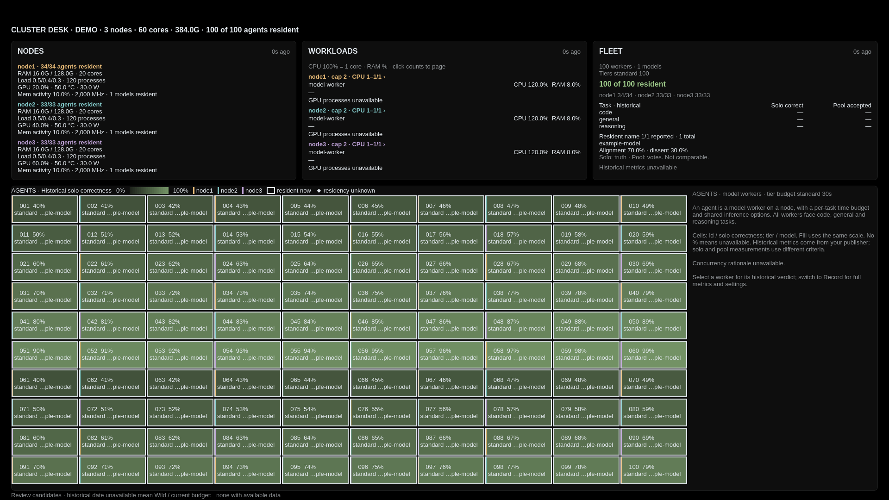

# Cluster Desk for Omarchy

A read-only cluster dashboard on a dedicated Omarchy workspace: node health,
GPU activity, host memory, workloads, model residency and a selectable agent grid.
Open the overlay when windows cover the desk.



The dashboard reads one local JSON file. It does not connect to your cluster,
scan local agent histories, run inference, approve requests, or control workloads.
Your existing telemetry publisher owns data collection and transport.
Infomarchy is not required; both plugins can run together.

## Install

Requires Omarchy with third-party Quickshell plugins and Bun:

```sh
omarchy pkg add bun
omarchy plugin add https://github.com/wulfkaal/omarchy-cluster-desk.git --enable --yes
```

In `~/.config/hypr/monitors.lua`, configure the file your publisher writes:

```lua
hl.env("CLUSTER_DESK_TELEMETRY", os.getenv("HOME") .. "/.local/state/cluster-desk/cluster.json")
hl.env("CLUSTER_DESK_WORKSPACE", "10")
hl.env("CLUSTER_DESK_TITLE", "CLUSTER DESK")
```

In `~/.config/hypr/bindings.lua`, choose an unused shortcut:

```lua
o.bind("SUPER + CTRL + SHIFT + D", "Cluster Desk overlay", "omarchy-shell shell toggle wulfkaal.gb10 '{}'")
```

Then apply the configuration:

```sh
hyprctl reload
hyprctl configerrors
omarchy restart shell
```

**Super+0** opens workspace 10 with the normal Omarchy bindings.
**Super+Ctrl+Shift+D** toggles the overlay. **Esc** first clears a selected agent,
then closes the overlay. Agent cards display details; they do not run commands.

`CLUSTER_DESK_WORKSPACE` accepts 1–99 and defaults to 10. The old
`GB10_CLUSTER_TELEMETRY` variable remains a fallback, so existing GB10 installations
can upgrade without moving their feed. There is no default telemetry path.
Configuration must reach Hyprland's environment; exporting it only in a terminal
will not change an already-running shell.

The plugin retains the ID **`wulfkaal.gb10`** for existing installations and
shortcuts. The repository and displayed name are Cluster Desk.

## What is published

This repository contains dashboard code, the telemetry contract, installation
instructions, tests and explicitly synthetic example data. The example's 100
numbered agents are invented capacity-test entries, all using `example-model`;
they are not a real roster or a description of anyone's work. The preview is
rendered from that same synthetic example.

No live agent names, tasks, prompts, role assignments, routing policies, model
inventory, measurements, endpoint configuration or telemetry files are shipped.
The dashboard has no orchestration engine or workload-control commands. Its
coordination surface consists of viewing node/agent state and selecting details.

## Data and limits

See [the telemetry contract](docs/telemetry.md) and the entirely synthetic
[example feed](examples/cluster.json). Existing GB10 v1/v2 feeds are accepted.
The compact layout supports 1–3 nodes and up to 100 agents. Missing fields remain
unknown; models are optional, and historical evaluation metrics are optional.
Memory figures preserve the unified-memory distinction: host RAM and reported
per-process GPU allocation are not added into a fictitious aggregate VRAM pool.

The feed becomes stale after 30 seconds. Missing or invalid input clears the
current data and shows an error. Files must be regular files, not symlinks, and
fit within 128 KiB. Duplicate JSON keys and invalid fields are rejected.
Publishers should write a private temporary file and atomically rename it into
place. Do not store credentials or unredacted sensitive text in the feed.

To view synthetic data without a publisher:

```sh
omarchy-shell wulfkaal.gb10 setDemo true
omarchy-shell wulfkaal.gb10 setDemo false
```

Demo mode is transient and resets on shell restart. The screenshot uses only
this example data. Nothing starts a cluster or loads a model.

## Diagnose, update, remove

```sh
omarchy-shell wulfkaal.gb10 status
omarchy-shell wulfkaal.gb10 refresh
omarchy plugin update wulfkaal.gb10 --yes
omarchy restart shell
```

A private GitHub repository requires authenticated Git access to install/update.

To remove:

```sh
omarchy plugin remove wulfkaal.gb10 --yes
omarchy restart shell
```

Remove the optional shortcut and environment entries if no longer used.
Existing telemetry files and publishers are not deleted.

## Development

```sh
omarchy pkg add bun qt6-declarative
bun test
omarchy plugin validate .
```

Tests cover strict telemetry parsing, file and snapshot bounds, a 100-agent
roster, a collector run with network/subprocess calls forbidden, QML syntax,
and an offscreen QML render with selection and freshness behavior. Rendering
uses small test theme stubs; installation is additionally checked against the
live Omarchy shell. The QML test requires Qt's `qml` and `qmllint` executables.

See [the extraction assessment](docs/assessment.md) for scope and remaining
limits. Derived from [Infomarchy](https://github.com/nixfred/infomarchy), with
original attribution retained under the [MIT license](LICENSE).
